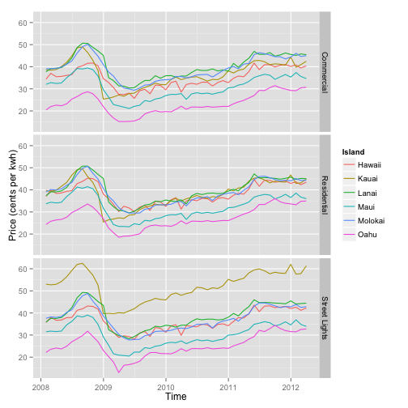

## Electricity Prices in Hawaii
1. Prices for electricity in Hawaii are among the highest in the United States
1. These prices vary not only by time but by island and sector
1. Sectors include Residential, Commercial, and Street Light uses
1. The following figure shows the data plotted with `ggplot2` (Source: [Hawaii Open Data](https://data.hawaii.gov/Government-Wide-Support/HI-Electricity-Prices/74g9-vewt))

--- .class #id 

## Price Change by Island and Sector over Time

 

---

## Exploring Price Variation
I created a [Shiny app](https://mching.shinyapps.io/HI_electricity_prices/) to provide medians for the price by time, island and sector

---

## Sample Calculation
1. This is an example of how the app works. 
1. We can give it dates such as 2010-01-01 through 2010-12-01 and ask for the island of Oahu and sector of Residential rates. 
1. The app returns the following value in cents per kilowatt-hour. 

```
##   Price
## 1 25.79
```


---


